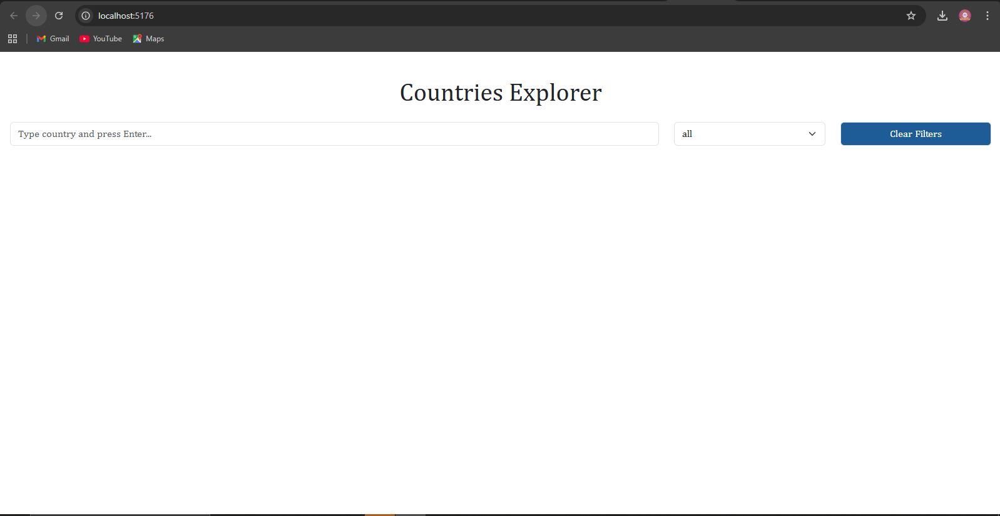

# Country Explorer

A simple web application that allows users to search for countries and view results using the REST Countries API.

---

## How to Run

1. **Clone the respository**
bash
git clone https://github.com/fereshtehazizi/Country-explorer.git

2. **Navigate into the project folder**  
cd Country-explorer

3. **Install dependencies**  
npm install
  
4. **Start the development server**  
npm start  

5. **View in browser**  
Open your browser and go to a link like: [http://localhost:3000](http://localhost:3000)

---

## API Endpoints Used

| Endpoint | Method | Description |
|----------|--------|-------------|
| `https://restcountries.com/v3.1/all` | GET | Fetches a list of all countries |
| `https://restcountries.com/v3.1/name/${query}` | GET | Searches for a specific country by name |
| `https://restcountries.com/v3.1/region/${region}` | GET | Searches for a specific country by region |

---

## Screenshots

**Home Page:**  
  <!-- Replace with your actual screenshot -->

**Results Page:**  
  <!-- Replace with your actual screenshot -->

> Make sure to save your screenshots in a folder called `screenshots` inside the repo.

---

## Author

Fereshteh Azizi  
[GitHub](https://github.com/fereshtehazizi)
